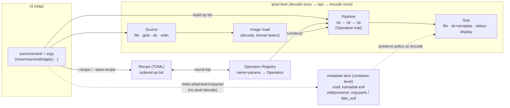

# Architecture

> Repo-level architecture for `crustyimg`. Authored during PROJECT DESIGN
> (Prompt 2a) for PROJ-001. Keep current as stages land — update the
> Mermaid diagram in the same change that changes the structure it shows.

## Overview

`crustyimg` is a single-binary Rust CLI that views images in the terminal
and performs the everyday transformations people actually reach for
(resize, optimize-for-web, thumbnail, convert, auto-orient, watermark, EXIF
`meta` strip/clean/set). Its defining idea is a **load-once pipeline**: an image
is decoded into one canonical in-memory model, an ordered list of
`Operation`s is applied in memory, and the result is written to a sink
exactly once. Because the operation list is serializable (a **recipe**),
the same edit tuned on one image replays unchanged across a whole batch.

This is a deliberate correction of the earlier prototype, whose core
mistakes were: mixing two image libraries (`image` + `photon-rs`),
re-reading each file from disk per operation, hardcoded output paths,
~1,000 lines of boolean flag-soup in one `main.rs`, an unused `tokio`
runtime, and zero tests. We do none of those here.

## Key Design Principles

These anchor every later decision; each links to the DEC that formalizes it.

1. **One canonical image model, one image library.** Everything is an
   `Image` wrapping `image::DynamicImage`. No second pixel library.
   (DEC-002)
2. **Decode once, encode once.** The pipeline holds the decoded image in
   memory and applies all operations to it; no per-operation disk
   round-trips. Metadata-only edits skip decode entirely. (DEC-002, DEC-003)
3. **`Operation` is the only pixel extension point.** New transforms are
   new `Operation` impls registered in one place; nothing else changes.
   (DEC-002)
4. **Metadata is a separate lane.** Pixel work (decode→ops→encode) drops
   metadata by nature; preserving or editing metadata happens at the
   container level without re-decoding pixels. The two lanes never share a
   code path. (DEC-003)
5. **Pure-Rust by default.** Default builds use only pure-Rust crates so
   Linux/macOS/Windows CI stays trivial; native codecs (mozjpeg, rexiv2,
   libavif) live behind cargo features. (DEC-004)
6. **Recipes round-trip.** A recipe is an ordered TOML list of operations;
   an operation registry maps `name + params` to an `Operation`, so a
   recipe serialized from a run deserializes back into the identical list.
   (DEC-005)
7. **No async runtime.** The CLI is synchronous; batch parallelism is
   data-parallel via `rayon`, not `tokio`. Startup must feel instant.
   (DEC-006)
8. **Errors are typed in the library, friendly at the binary.** The library
   returns `thiserror` enums; `main` maps them to `anyhow` context and exit
   codes. (DEC-007)

## Module / Layer Structure

The crate is a library (`crustyimg`) plus a thin binary (`main.rs`). The
library is layered so the CLI is the only part that knows about `clap`,
and the pixel core never knows about files, recipes, or terminals.

```
crustyimg (lib)
├── image/        canonical model: Image wrapper, decode/load, ImageInfo,
│                 ImageError (the pixel core; no I/O policy, no clap)
├── operation/    Operation trait, OperationParams, the operation Registry
│                 (extension point; concrete ops arrive in later stages)
├── pipeline/     Pipeline executor: decode once → ordered ops → result
├── recipe/       Recipe struct, TOML (de)serialization, round-trip via Registry
├── source/       Source: single file | glob | dir | stdin → iterator of inputs
├── sink/         Sink: file | dir+name-template | stdout | terminal display (viuer)
├── metadata/     container lane: read (kamadak-exif), edit/preserve
│                 (img-parts / little_exif). Parallel to the pixel lane.
│                 (scaffolded STAGE-001; populated STAGE-004)
├── cli/          clap derive types, subcommand surface, arg → pipeline wiring
└── error.rs      crate-wide error/result aliases

main.rs           parse args, dispatch into cli/, map errors → exit codes
```

Layering rule (dependency direction, top depends on nothing above it):

```
cli  →  recipe, source, sink, pipeline, metadata
pipeline  →  operation, image
operation →  image
recipe    →  operation (via Registry)
source/sink → image
image     →  (no internal deps)
```

`image/` and `operation/` are the stable core. Everything user-facing
(`cli`, `recipe`, `source`, `sink`) sits above and may churn; the core
should not.

## Components



Component responsibilities:

- **Source** — resolves a CLI argument into an ordered list of inputs. A
  single path yields one; a glob or directory yields many; `-` yields one
  stdin stream. This is where batch fan-out originates (STAGE-005 drives it
  in parallel; the abstraction lands in STAGE-001).
- **`Image`** — the one canonical model. Wraps `image::DynamicImage`, plus
  the source format, dimensions, and a handle to sidecar metadata bytes
  when the container lane needs them.
- **`Operation`** — a named, parameterized, pure transform
  `apply(Image) -> Result<Image>`. The trait is small on purpose; concrete
  ops (resize, thumbnail, watermark, …) are later stages.
- **`Pipeline`** — owns the decoded `Image` and folds an ordered
  `Vec<Box<dyn Operation>>` over it, then hands the result to a `Sink`.
  Decodes once, encodes once.
- **Operation Registry** — maps an operation `name` + serde params to a
  constructed `Operation`. The single point recipes and the CLI both go
  through, so recipes round-trip.
- **`Recipe`** — an ordered list of `(name, params)` serialized as TOML.
  `--save-recipe` writes one; `apply --recipe` reads one.
- **`Sink`** — terminal display (viuer), a file, a directory plus a
  name-template (`{stem}_web.{ext}`), or stdout (`-`).
- **metadata lane** — container-level read/edit that never decodes pixels.
  Read via `kamadak-exif` (read-only); edit/preserve via `img-parts`
  (EXIF/ICC segments) and `little_exif` (tag write). Default-preserve
  policy on the pixel encode path keeps orientation + ICC + copyright and
  drops GPS unless asked (DEC-003).

## Data Flow

**One-shot transform** (`crustyimg resize in.jpg -o out.jpg --max 1200`):
1. `cli` parses the subcommand into a typed command + one `Operation`.
2. `source` resolves `in.jpg` to one input.
3. `Image::load` decodes once.
4. `pipeline` applies `[Resize]` in memory.
5. `sink` encodes once to `out.jpg`; default-preserve policy carries
   orientation/ICC/copyright across (STAGE-004).

**Recipe + batch** (`crustyimg apply --recipe web.toml "photos/*.jpg"
--out-dir optimized/ --jobs 8`):
1. `recipe` parses `web.toml`; `registry` constructs the op list.
2. `source` expands the glob to N inputs.
3. `rayon` runs the pipeline per input across `--jobs` threads
   (STAGE-005); each input is decode-once → ops → sink-with-template.
4. `indicatif` shows progress (STAGE-005).

**Metadata-only** (`crustyimg meta clean --gps in.jpg`):
1. `cli` routes to the **metadata lane** — no decode, no `Operation`.
2. `metadata` edits the container in place / to output, dropping GPS
   segments only.

## Boundaries and Interfaces

- **lib ↔ binary:** the library exposes `Operation`, `Pipeline`, `Recipe`,
  `Source`, `Sink`, `Image`, and the registry. `main.rs` only parses args,
  calls into `cli`, and maps errors to exit codes.
- **pixel lane ↔ metadata lane:** strictly separate. The only point they
  meet is the default-preserve policy applied at encode time. Metadata edits
  must NOT go through the pixel encode path (constraint
  `metadata-not-via-pixel-encode`).
- **pure-Rust ↔ native:** native codecs are compile-time `#[cfg(feature)]`
  paths; default builds never link them.

## Crate Choices (versions pinned at SPEC-001 build)

Pure-Rust default set:

| Crate | Version (target) | Role |
|---|---|---|
| `image` | `0.25` | canonical decode/encode + `DynamicImage` (DEC-002) |
| `fast_image_resize` | `5` | SIMD resize backend (DEC-008) |
| `clap` | `4` (derive) | subcommands + args |
| `serde` | `1` | recipe (de)serialization |
| `toml` | `0.8` | recipe format (DEC-005) |
| `anyhow` | `1` | error context at the binary boundary (DEC-007) |
| `thiserror` | `2` | typed library errors (DEC-007) |
| `viuer` | `0.9` | terminal display sink |
| `glob` | `0.3` | glob source expansion |
| `walkdir` | `2` | directory source expansion |
| `kamadak-exif` | `0.6` | read-only EXIF (metadata lane, DEC-003) |
| `img-parts` | `0.3` | container-level EXIF/ICC segment edit (DEC-003) |
| `little_exif` | `0.6` | EXIF tag write (metadata lane, DEC-003) |
| `rayon` | `1` | data-parallel batch (STAGE-005, DEC-006) |
| `indicatif` | `0.17` | batch progress (STAGE-005) |

Feature-gated native (off by default, DEC-004):

| Feature | Crate | Adds |
|---|---|---|
| `mozjpeg` | `mozjpeg` | better JPEG size/quality (native libjpeg-turbo) |
| `avif` | `ravif` / libavif | AVIF encode (later) |
| `rexiv2` | `rexiv2` | richer metadata r/w (native gexiv2) |

> Exact patch versions and the final crate list are pinned in `Cargo.toml`
> at SPEC-001 build and recorded in `AGENTS.md` §5. Adding any new top-level
> crate requires a DEC (constraint `no-new-top-level-deps-without-decision`).

## Deployment Topology

A single statically-built binary. No server, no database, no network at
runtime. Distributed as a release artifact (GitHub Releases) and intended
for `brew` / `crates.io`. CI builds and tests on Linux, macOS, and Windows
(DEC-009).

## References

- Data model: `./data-model.md`
- CLI contract: `./api-contract.md`
- Feature research: `./feature-exploration.md`
- Decisions: `/decisions/` (DEC-002 … DEC-009)
- Constraints: `/guidance/constraints.yaml`
