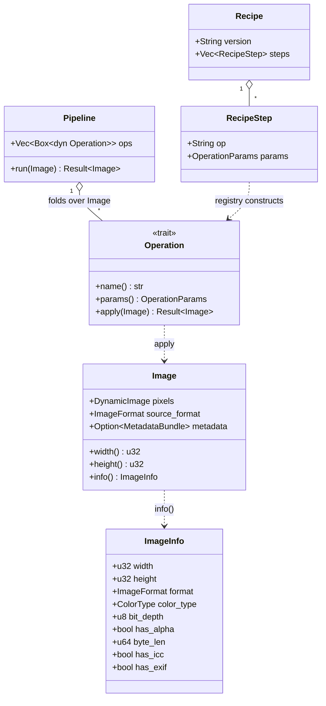

# Data Model

> `crustyimg` has no database. Its "data model" is (a) the in-memory types
> the pipeline operates on and (b) the on-disk **recipe** schema. Authored
> during PROJECT DESIGN (Prompt 2a). Keep in sync with the actual types as
> stages land.

## In-Memory Model

The pixel lane operates on three core types plus the operation/recipe
types. These are conceptual signatures — exact field sets are pinned at
build (SPEC-002/003/005).



### `Image` — the one canonical model

Wraps `image::DynamicImage` (the single pixel library, DEC-002). Holds the
decoded pixels, the detected source format, and optionally a
`MetadataBundle` (raw EXIF/ICC bytes captured at load for the
default-preserve policy). The pipeline owns exactly one `Image` per input
and mutates it through `Operation`s — **decoded once, encoded once**.

| Field | Type | Notes |
|---|---|---|
| `pixels` | `image::DynamicImage` | the only pixel representation |
| `source_format` | `image::ImageFormat` | detected on load |
| `metadata` | `Option<MetadataBundle>` | raw EXIF/ICC for preserve policy |

### `ImageInfo` — read-only inspection

What `crustyimg info` reports. Derived from a decoded `Image` (and the
container lane for ICC/EXIF presence). No mutation.

### `Operation` — the pixel extension point (DEC-002)

A small trait. Every transform is an impl; concrete ops land in later
stages (STAGE-001 ships only the trait + registry, zero concrete ops).

```
trait Operation {
    fn name(&self) -> &str;                 // registry key, also recipe `op`
    fn params(&self) -> OperationParams;    // serde-serializable, for recipes
    fn apply(&self, img: Image) -> Result<Image, ImageError>;
}
```

`OperationParams` is a serde-friendly value (e.g. a `toml::Value` /
typed enum per op) carrying the operation's arguments so a recipe can
record and replay them.

### `Pipeline` — the executor

Holds an ordered `Vec<Box<dyn Operation>>` and folds it over one `Image`.
Pure in-memory; no disk access between ops. The metadata lane is NOT
expressed as `Operation`s (DEC-003) — it is a separate path.

### Operation Registry (DEC-005)

A map `name -> fn(OperationParams) -> Result<Box<dyn Operation>>`. Both the
CLI and the recipe loader construct operations through it, which is what
makes recipes round-trip: an op serialized as `name + params` deserializes
back into the identical `Operation`.

## Metadata Lane Model (DEC-003)

A `MetadataBundle` holds the container-level segments the preserve policy
cares about. It is read with `kamadak-exif` (read-only) and edited with
`img-parts` / `little_exif`. It never participates in pixel decode/encode.

| Segment | Default on pixel encode | Editable via |
|---|---|---|
| Orientation | preserved | container lane |
| ICC profile | preserved | container lane |
| Copyright / Artist | preserved | `set` (little_exif) |
| GPS | **dropped** unless `--keep-gps` | `meta clean --gps` removes |
| All other EXIF/IPTC/XMP | dropped on pixel lane | `meta strip` removes; `meta copy` transfers |

## Recipe Schema (TOML)

A recipe is a versioned, ordered list of operation steps. The same recipe
runs on one image or a batch. `op` is the registry key; the remaining keys
in each `[[step]]` table are that operation's params.

### Schema

| Key | Type | Required | Description |
|---|---|---|---|
| `version` | string | yes | Recipe schema version, e.g. `"1"`. Lets the loader reject incompatible recipes. |
| `name` | string | no | Human label for the recipe. |
| `description` | string | no | Free text. |
| `[[step]]` | array of tables | yes (≥1) | Ordered operations. |
| `step.op` | string | yes | Operation registry name. |
| `step.<param>` | per-op | per-op | Parameters for that operation. |

### Worked example — `web.toml`

A "prep for web" recipe: orient, downscale, sharpen, watermark, drop GPS.
(Operation names are illustrative; concrete ops are defined in their stages
and must match their registry keys.)

```toml
version = "1"
name = "web-prep"
description = "Downscale + sharpen + watermark + strip GPS for blog images"

[[step]]
op = "auto-orient"

[[step]]
op = "resize"
mode = "max"          # max | exact | percent | fit | fill | cover
width = 1200
# height omitted -> aspect-preserving on the long edge

[[step]]
op = "unsharp"
sigma = 0.8
amount = 0.6

[[step]]
op = "watermark"
image = "assets/logo.png"
gravity = "south-east"  # gravity: north/south/east/west/center compass
opacity = 0.7
scale = 0.15            # fraction of base width
margin = 24

[[step]]
op = "clean-gps"        # metadata-lane step; drops only GPS
```

Running it:

```bash
# tune on one image, save the chain
crustyimg edit hero.jpg --resize-max 1200 --unsharp 0.8,0.6 \
    --watermark assets/logo.png --save-recipe web.toml -o hero_web.jpg

# replay unchanged across a directory, in parallel
crustyimg apply --recipe web.toml "photos/*.jpg" \
    --out-dir optimized/ --name-template "{stem}_web.{ext}" --jobs 8
```

### `resize` step param keys (PINNED — SPEC-010 / DEC-014)

The `resize` op carries a required `mode` plus per-mode dimension keys, as
flat integer/float values in the `[[step]]` table (parsed via the
`OperationParams` accessors — **not** a `"WxH"` string; that string form is a
CLI concern, SPEC-011). `params()` emits **only** the keys the mode uses, so
the step round-trips minimally (e.g. `max` records `mode` + `width`, with
`height` absent).

| `mode` | Required keys | Meaning |
|---|---|---|
| `max` | `width` (= long-edge cap N) | longest edge ≤ N; never upscale |
| `exact` | `width`, `height` | force exactly W×H; aspect ignored |
| `percent` | `percent` (P) | scale both dims by P/100 |
| `fit` | `width`, `height` | fit inside W×H (aspect kept); never upscale |
| `cover` | `width`, `height` | cover W×H (aspect kept; may upscale); no crop |
| `fill` | `width`, `height` | `cover` then center-crop to exactly W×H |

A missing/unknown `mode`, a missing required key, a wrong-typed key, or a
non-positive value is a typed error at recipe build time
(`RecipeError::InvalidOperation`, via `RegistryError::InvalidParams`) — not a
silent skip and not `UnknownOperation`.

### Round-trip guarantee (DEC-005)

`load(save(recipe)) == recipe`: serializing a recipe to TOML and reading it
back through the registry must yield the identical ordered operation list.
This is a STAGE-001 acceptance test (SPEC-005).

### Name templates (Sink)

Batch output names come from a template string over the input path:

| Token | Expands to |
|---|---|
| `{stem}` | input filename without extension |
| `{ext}` | output extension (from format/convert) |
| `{name}` | input filename with extension |
| `{parent}` | input's parent directory name |

Default template: `{stem}.{ext}` into `--out-dir` (or alongside the input
if no out-dir). Templates may not contain path separators that escape
`--out-dir` (path-traversal guard — see `SECURITY.md`).

## Schema Evolution

- Recipes carry an explicit `version`. The loader rejects a recipe whose
  `version` it does not understand rather than silently misinterpreting it.
- New operations are additive: they register a new `name`; old recipes are
  unaffected. Removing or renaming an op is a breaking change and must bump
  the recipe `version` and ship a migration note.

## Data Lifecycle

No persistent store. Inputs are read-only; the tool never overwrites an
input unless the user explicitly targets it as output. All state is the
in-memory `Image` for the duration of one pipeline run. Recipes are
user-authored files the tool reads and writes on request only.
