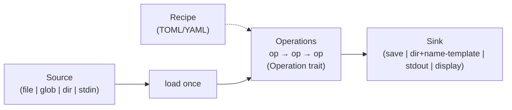

# Feature Exploration — crustyimg

> Pre-design research feeding PROJ-001. Captures the candidate feature
> surface, the workflow model (single image → recipe → batch), and the
> technical considerations that shape architecture. Decisions made here
> graduate to `decisions/DEC-*.md` during the design phase.

Legend: 🟢 in the original prototype · ⭐ user-requested · ✅ MVP ·
⏩ fast-follow · 💎 stretch / differentiator

## Feature catalog

### Inspect / view
- 🟢✅ `view` — terminal display (viuer)
- ✅ `info` — dimensions, format, bytes, color type, bit depth, alpha, ICC/EXIF presence
- ⏩ `compare` — SSIM / PSNR between two images ("did optimization hurt quality?")
- ⏩ histogram / dominant-color extraction · ⏩ `open` externally (Preview/Safari/Chrome/default)
- 💎 blurhash / thumbhash generation · 💎 dominant-color → CSS

### Geometry
- 🟢✅ `resize` (max / exact / percent / fit-fill-cover) · ✅ `thumbnail`
- ✅ `auto-orient` — apply EXIF orientation then strip it (most common silent bug in image tools)
- ⭐⏩ `crop` (rect / gravity / center / aspect; 💎 entropy/smart) · ⏩ `rotate` · ⏩ `flip`/`flop` · ⏩ `trim` · ⏩ `pad`/`extend`

### Format / encoding / web-optimize
- 🟢✅ `web` / `optimize` (downscale/keep-dims + real quality + strip metadata) · ✅ `convert` (format change) · 🟢✅ `meta strip`
- ⏩ **WebP** output (biggest real web-size win) · 💎 **AVIF** output (behind a cargo feature; slow encode)
- ⏩ progressive JPEG, PNG compression level, GIF/PNG quantization · 💎 target-file-size / target-SSIM auto-quality

### Color / tone
- ⏩ brightness / contrast / gamma · saturation / hue · levels / curves · auto-contrast / normalize · invert · threshold · posterize

### Effects (the `Operation`-trait playground)
- 🟢⏩ grayscale, sepia, solarize, pixelize, sobel/edges · blur (gaussian/box), unsharp-mask sharpen, emboss, vignette, oil-paint, noise add/reduce, custom convolution · ⏩ named presets

### Compositing / annotation
- ⭐✅ **`watermark`** — image overlay (gravity, opacity, scale, tile) + text watermark (font via `ab_glyph` + `imageproc::drawing`)
- ⏩ caption/text, draw shapes/border, composite/overlay with blend modes
- ⏩ `montage` / contact-sheet (was in original docs) · `append` (H/V)

### Generation / utility
- ✅ create solid/gradient/noise image — native test fixtures (replaces the original's shell-out to ImageMagick `convert gradient:`)
- 💎 fetch placeholder from Picsum/Unsplash (see original `public_api_ideas.md`)

## Workflow model: one image → recipe → many images

The unifying idea: **a recipe is a serialized list of `Operation`s**, and
the same recipe runs on one image or thousands.

Three usage modes, shipped in order:
1. **One-shot multi-op** (experiment on a single image, like an editor):
   `crustyimg edit in.jpg --resize 800 --sharpen --watermark logo.png -o out.jpg`
2. **Record → recipe:** `--save-recipe web.toml` captures the chain just tuned.
3. **Batch apply:** `crustyimg apply --recipe web.toml "photos/*.jpg" --out-dir optimized/ --jobs 8`
   — rayon parallel across files, indicatif progress, output-name templates (`{stem}_web.{ext}`).

Core abstractions required from day one (STAGE-001):
- `Operation` trait (name + params + `apply`)
- operation **registry** (name+params → constructor) so recipes round-trip
- **input-source** abstraction (single / glob / dir / stdin)
- **output-sink** abstraction (file / dir+template / stdout / display)
- recipe (de)serialization (serde + TOML)

💎 Later: a ratatui TUI for live-preview editing that exports a recipe —
additive on top of this architecture, not a rewrite.

## Metadata (EXIF/IPTC/XMP) — dual-lane architecture

The `image` crate **discards metadata on encode**, so the pixel pipeline
(decode → ops → encode) inherently strips everything. Editing or preserving
metadata requires **container-level** manipulation without re-decoding pixels.

Two lanes:
- **pixel lane** — decode → ops → encode; metadata naturally dropped
- **metadata lane** — container-level edit (`img-parts` for EXIF/ICC segments;
  `little_exif` or `rexiv2` for tag read/write); pixels untouched

Commands: `meta strip` (all) · `meta clean --gps` (drop only location — privacy win) ·
`meta set --artist/--copyright/--description` · `meta copy from→to`.

Default-preserve policy to settle as a DEC: on pixel-lane ops, keep
orientation + ICC + copyright, drop GPS unless asked otherwise.

Reading EXIF: `kamadak-exif` (read-only — cannot write).

## Technical considerations

| Area | Direction |
|---|---|
| Resize speed | `fast_image_resize` (SIMD) over `image::imageops::resize` — often 5–15× faster; dominant cost in thumbnail/web batch |
| JPEG encode | `image` encoder default; `mozjpeg`/`turbojpeg` (libjpeg-turbo) for best size/quality — native dep, gate behind feature |
| Decode | `zune-*` family (pure-Rust, fast); `image` already uses parts |
| Batch parallelism | `rayon` across files; bound concurrency by memory (≈ W×H×4 bytes per decoded image) |
| Decode/encode once | pipeline decodes once, applies all ops in memory, encodes once (the original re-read disk per op); metadata-only edits skip decode |
| Modern formats | WebP (`image`) fast-follow; AVIF (`ravif`, pure-Rust rav1e, slow) behind opt-in feature |
| Quality metrics | SSIM/DSSIM enables "smallest file ≥ threshold" auto-tuning (differentiator) |
| Async | none — drop `tokio` (original used it for nothing); CLI startup must be instant |
| Codec policy | **pure-Rust by default** (image, zune, fast_image_resize, ravif) so Linux/macOS/Windows CI stays trivial; native codecs (mozjpeg/rexiv2/libavif) behind cargo features |
| Color / ICC | `image` ignores ICC; preserve via container lane, don't silently destroy. Conversion (lcms2) post-MVP |
| Shell composability | support `-`/stdin→stdout for Unix pipes |
| Testability | golden-image tests, byte-size assertions, SSIM thresholds, deterministic encoders |

> Crate choices above are candidates — confirm exact crates/versions/APIs
> during the design phase and pin in `AGENTS.md` + `DEC-*`.

## Decisions to formalize during design (DEC-*)

1. **Single image model + `Operation` trait** as the pipeline keystone (vs. multiple libraries — the original's core mistake).
2. **Metadata dual-lane** model + default-preserve policy (keep orientation/ICC/copyright, drop GPS).
3. **Codec policy:** pure-Rust default, native codecs behind cargo features; WebP fast-follow, AVIF feature-gated later.
4. **Recipe format** (TOML via serde) + operation-registry design.
5. **Resize backend:** `fast_image_resize` vs `image::imageops`.
