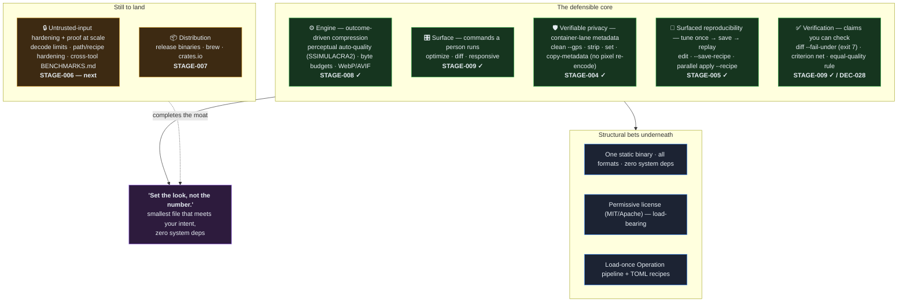

# crustyimg — the moat

*A living strategy note: what makes crustyimg defensibly different, what's built,
and what still has to land. Snapshot: 2026-06-19, after STAGE-008 + STAGE-009 +
STAGE-004 + STAGE-005 — the **MVP functional surface is complete**.*

## The one-line claim

**Tell the tool the outcome you want — a visual quality or a file-size budget, in a
modern format — and get the smallest file that meets it, from one pure-Rust binary
with zero system dependencies.** "Set the look, not the number."

This reframes image prep from *guess-a-quality-knob* to *declare-an-intent*. Almost
nothing in the CLI layer does this, and that's the wedge.

## Why the space is open

- **The product/CLI layer is stale.** ImageMagick is cryptic and heavy (Windows DLL
  pain); libvips/`vips` is fast but obscure and a system dependency; `sharp` is
  Node + native; squoosh-cli is unmaintained; ImageOptim is macOS-only; the
  single-format optimizers (jpegoptim/oxipng/pngquant/cwebp/avifenc) each do exactly
  one format; exiftool is hard and strips incompletely; imgproxy/thumbor are servers,
  the wrong shape for a build step.
- **The component (crate) layer is hot** — a pure-Rust imaging frontier exists
  (zune, the awxkee SIMD cluster, ravif, jxl-oxide, ssimulacra2) — but **nobody
  assembles it into one ergonomic, single-binary tool.**
- **Two industry shifts crustyimg rides:** (1) "encode to a perceptual *target*, not
  a quality number"; (2) pure-Rust safe-SIMD replacing C/FFI across the stack.

## The moat at a glance

## What's built (the defensible core)

### 1. The engine — outcome-driven compression (STAGE-008)
- **Perceptual auto-quality:** binary-search the encoder quality against the
  **SSIMULACRA2** metric → the smallest file that still clears a visual target
  (`--target visually-lossless` / `--ssim <N>`).
- **Byte budgets:** `--max-size <KB>` with a dimension-reduction fallback when
  quality alone can't fit — works for every format.
- **Modern formats:** WebP (pure-Rust, default) and AVIF (feature-gated), behind a
  clean `LossyFormat` seam. The search is encoder-agnostic.
- All pure-Rust by default, zero system deps.

### 2. The surface — commands a person actually runs (STAGE-009)
- **`optimize`** — one button: auto-orient + strip metadata + perceptual
  visually-lossless re-encode, format/size-preserving. The "just make this web-good"
  default.
- **`diff`** — a perceptual SSIMULACRA2 score *and* a `--fail-under` CI
  visual-regression gate (its own exit code 7).
- **`responsive`** — width × format variants + a paste-ready `<picture>`/srcset
  snippet. The deliverable a web developer actually ships.

### 3. Verifiable privacy — drop metadata without touching pixels (STAGE-004)
- **Container-lane metadata ops:** `strip` (all metadata), `clean --gps` (selective
  location removal), `set` (artist/copyright/description), `copy-metadata` — all
  operate on the **container, with no pixel re-encode** (DEC-029/030), so removing
  GPS does not recompress the image. This is the *verifiable* part: privacy without
  a quality cost, and a default drop-GPS policy on pixel-lane encodes (`--keep-gps`
  to opt out).
- **Compositing:** `watermark --image` / `--text` (bundled BSD-3 font, DEC-031/032).
- *Still thin here:* an EXIF **audit-as-linter** (a CI gate that fails when
  unexpected metadata is present) — the `CheckFailed`/exit-7 plumbing exists and is
  reusable, but the command isn't built yet.

### 4. Surfaced reproducibility — tune once → save → replay (STAGE-005)
- **`edit`** — chain an ordered op list on one image in a single decode→ops→encode
  pass (the "experiment like an editor" mode).
- **`--save-recipe`** — capture that exact chain as a TOML recipe via the operation
  registry (DEC-005); the round-trip is **byte-pinned** (`edit` output ==
  `apply`-of-the-saved-recipe output).
- **`apply --recipe`** — replay a recipe across a file / glob / directory in
  **parallel** (rayon, `-j N`, DEC-006) with an `indicatif` progress bar and exit-6
  partial-failure semantics (DEC-015/033).
- This is the headline workflow the recipe/registry foundation (STAGE-001) was built
  toward: the same recipe runs unchanged on one image and on a thousand.

### 5. Verification — claims you can check (STAGE-009)
- `diff` makes quality measurable; the `criterion` benchmark net measures the hot
  paths. Standing rule (DEC-028): **any size/speed claim is gated on equal quality.**
  Honesty is itself a differentiator in a space full of quality-blind "smaller!"
  claims.

### Structural bets underneath all of it
- **One static binary, all formats, zero system deps by default.**
- **Permissive license (MIT/Apache)** — load-bearing: it's why the codecs are
  pure-Rust and why the tool is freely embeddable/redistributable.
- **Reproducible** — a load-once `Operation` pipeline + TOML recipes as the base,
  now surfaced end-to-end (STAGE-005).

## Where the moat is still thin (honest)

| Axis | Status | Lands in |
|---|---|---|
| Verifiable privacy (selective `clean --gps`, container-lane metadata) | **built** (STAGE-004) — GPS/metadata removed with no pixel re-encode; the EXIF **audit-as-linter** command is the remaining piece | STAGE-004 ✓ (audit-linter: later) |
| Surfaced reproducibility (`edit`/`--save-recipe`/parallel `apply`) | **built** (STAGE-005) — tune-once → save → replay is two commands sharing one byte-stable recipe format | STAGE-005 ✓ |
| Untrusted-input hardening (decode limits, path/recipe traversal, `cargo-audit`-in-CI) | **not built** — the recipe/path/`edit` surfaces are now the primary attack surface to harden | STAGE-006 — next |
| Proof at scale (cross-tool + quality-per-byte comparisons, `BENCHMARKS.md`) | only the local micro-net exists | STAGE-006 / later |
| Distribution (release binaries, brew, crates.io) | not released — *a moat nobody can `brew install` isn't fully real* | STAGE-007 |

## Net read

The moat is now **built across all four core axes** — outcome-driven quality +
modern formats (the wedge), web-delivery surface, verifiable privacy, and surfaced
reproducibility — with a credibility leg (`diff` + equal-quality rule) underneath.
**The MVP's functional surface is complete.** What remains is *trust and reach*, not
new capability: **STAGE-006** (hardening + a security assessment of the now-rich
untrusted-input surface — recipes, paths, decode limits — plus proof-at-scale
benchmarks) and **STAGE-007** (distribution: release binaries, brew, crates.io).
A capable tool that can't be safely fed untrusted input and can't be `brew install`ed
isn't a finished moat — that's the next stage's job.

## Pointers

- Engine: `src/quality/` (the SSIMULACRA2 search + `LossyFormat` seam), `src/sink/`
  (per-format encode). Surface: `src/cli/` (`optimize`/`diff`/`responsive`/`edit`/
  `apply`). Privacy: `src/metadata/` (container-lane). Recipes: `src/recipe/` +
  `src/operation/registry.rs` (the round-trip seam).
- Decisions: DEC-019 (perceptual), DEC-020/021/022 (AVIF/WebP), DEC-023 (size
  fallback), DEC-024 (optimize), DEC-025 (diff + exit 7), DEC-026 (responsive),
  DEC-027 (display default), DEC-028 (benchmarking + equal-quality principle),
  DEC-029/030 (container-lane metadata), DEC-031/032 (watermark overlay + font),
  DEC-005 (recipe round-trip), DEC-006 (rayon, no async), DEC-015 (partial-batch
  exit 6), DEC-033 (indicatif).
- Roadmap + competitive synthesis: `docs/sessions/2026-06-16-roadmap-and-stage-004-decision-handoff.md`.
